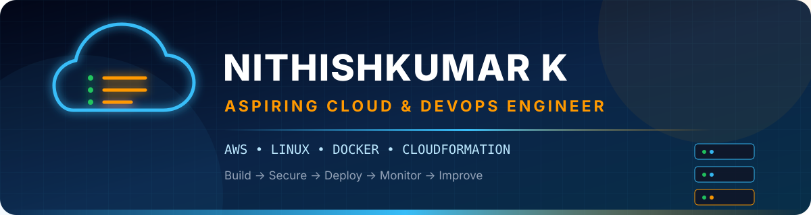
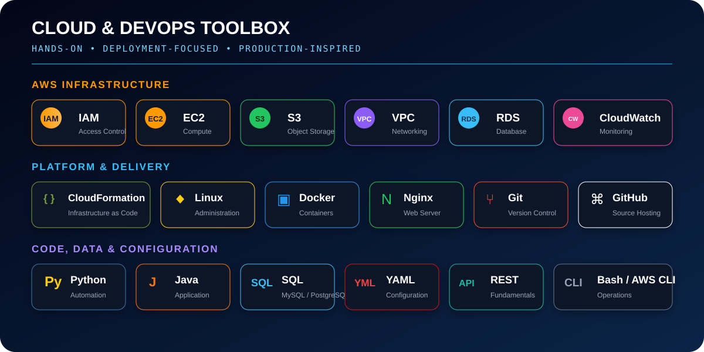
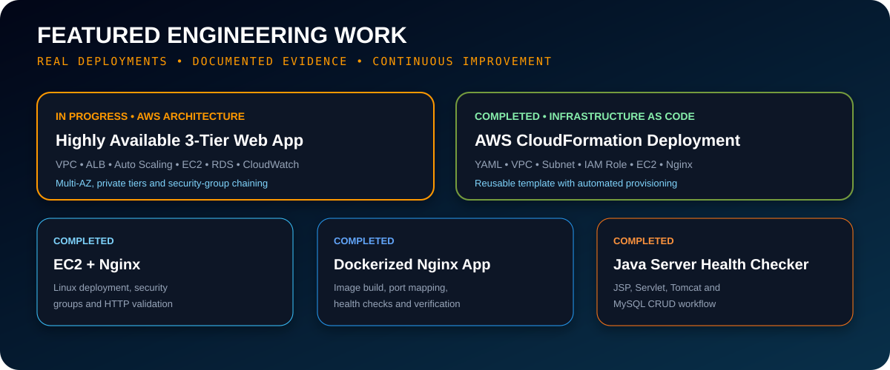
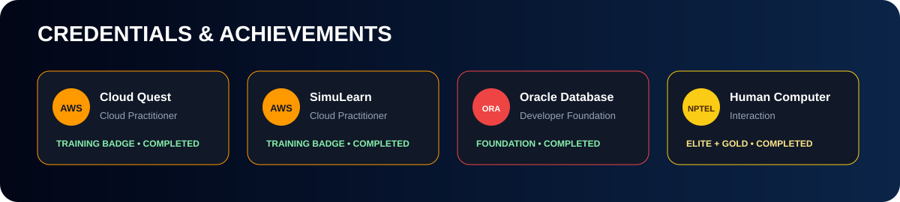
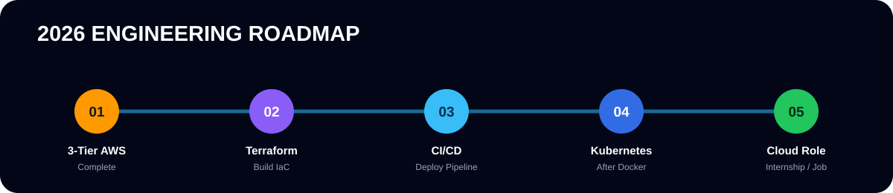

<div align="center">



### Aspiring Cloud & DevOps Engineer

Final-year B.Tech Information Technology student building secure, scalable and production-inspired cloud solutions.

[Portfolio](https://nithish-portfolio-rho.vercel.app) · [LinkedIn](https://www.linkedin.com/in/nithishkumar-k-072726388) · [Email](mailto:nithishdev29@gmail.com) · [Repositories](https://github.com/NITHISHKUMAR-IT?tab=repositories)

</div>

---

## Cloud Profile

```yaml
name: Nithishkumar K
role: Aspiring Cloud & DevOps Engineer
education: Final-Year B.Tech Information Technology
college: Mahendra Engineering College
location: Tamil Nadu, India
current_build: Highly Available 3-Tier Web Application on AWS
career_target: Cloud / AWS / DevOps Internship
```

- Hands-on with AWS networking, compute, storage, security and monitoring.
- Deployed applications using Linux, Nginx, Docker and AWS CloudFormation.
- Building real projects with deployment evidence and technical documentation.
- Interested in cloud security, reliable infrastructure and DevOps automation.

<details>
<summary><strong>My learning method</strong></summary>

```text
Learn Concept → Deploy → Create Failure → Troubleshoot → Fix → Document → Improve
```

I use production-inspired incidents to understand why infrastructure fails and how to recover it safely.

</details>

---

## Skills & Technology



### AWS Experience

| Area | Services and concepts |
|---|---|
| Identity & Security | IAM users, groups, policies, roles, MFA and least privilege |
| Compute | EC2, AMIs, user data, Auto Scaling and load-balanced workloads |
| Storage | S3, EBS, EFS and lifecycle-oriented storage decisions |
| Networking | VPC, public/private subnets, route tables, IGW, NAT Gateway and Security Groups |
| Database | RDS fundamentals and DynamoDB learning labs |
| Operations | CloudWatch metrics, alarms, AWS CLI and deployment verification |
| Infrastructure as Code | CloudFormation YAML templates and stack lifecycle |

### Current Learning — Clearly Separated

`Terraform` · `CI/CD Pipelines` · `Jenkins` · `Kubernetes` · `Google Cloud Fundamentals`

> These are roadmap technologies, not claimed as completed production skills.

---

## Featured Projects



### 1. Highly Available 3-Tier Web Application on AWS

**Status:** In Progress  
**Repository:** [aws-3tier-web-application](https://github.com/NITHISHKUMAR-IT/aws-3tier-web-application)

```text
Users → Route 53 → Application Load Balancer → Auto Scaling EC2 → Amazon RDS
                         Public Subnets          Private Subnets    DB Subnets
```

- Multi-AZ VPC with public, application and database subnet layers.
- Application Load Balancer and Auto Scaling architecture.
- Private RDS database tier and Security Group chaining.
- IAM, CloudWatch, S3 and production-oriented documentation.

### 2. Infrastructure as Code with AWS CloudFormation

**Status:** Completed  
**Repository:** [aws-cloudformation-iac](https://github.com/NITHISHKUMAR-IT/aws-cloudformation-iac)

- Reusable CloudFormation YAML template.
- Custom VPC, public subnet, routing and internet connectivity.
- IAM role and EC2 provisioning.
- Automated Nginx installation and deployment verification.

### 3. Amazon EC2 + Nginx Web Deployment

**Status:** Completed  
**Repository:** [aws-ec2-nginx-hosting](https://github.com/NITHISHKUMAR-IT/aws-ec2-nginx-hosting)

- Linux EC2 deployment and Security Group configuration.
- Secure remote administration and Nginx setup.
- Application hosting, service checks and HTTP validation.

### 4. Dockerized Nginx Web Application

**Status:** Completed  
**Repository:** [dockerized-nginx-web-app](https://github.com/NITHISHKUMAR-IT/dockerized-nginx-web-app)

- Reusable Docker image for an Nginx web application.
- Port mapping, container health checks and HTTP verification.
- Documented image build and container runtime workflow.

<details>
<summary><strong>More hands-on projects</strong></summary>

| Project | Focus | Status |
|---|---|---|
| [Amazon S3 Static Website Hosting](https://github.com/NITHISHKUMAR-IT/aws-s3-static-website-hosting) | S3 website hosting and bucket access configuration | Completed |
| [Java Cloud Server Health Checker](https://github.com/NITHISHKUMAR-IT/java-cloud-server-health-checker) | Java, JSP/Servlet, Tomcat and MySQL CRUD application | Completed |
| [Secure RAG FastAPI Backend](https://github.com/NITHISHKUMAR-IT/secure-rag-fastapi-backend) | FastAPI, document retrieval and grounded responses | In Progress |
| [Cloud Portfolio](https://github.com/NITHISHKUMAR-IT/nithish-portfolio) | AWS-console-inspired personal portfolio | In Progress |

</details>

---

## Cloud Engineering Workflow


```text
Requirement
    ↓
Architecture Design
    ↓
Secure Provisioning
    ↓
Application Deployment
    ↓
Health Verification & Monitoring
    ↓
Troubleshooting Documentation
```

### Production Principles Practised

- Least-privilege IAM access.
- Private application and database network tiers.
- Multi-AZ design where availability requires it.
- Monitoring and deployment validation.
- Reusable infrastructure definitions.
- Clear README documentation with evidence.

---

## Credentials & Achievements



| Credential | Issuer | Verification |
|---|---|---|
| AWS Cloud Quest: Cloud Practitioner | AWS | [Verify credential](https://www.credly.com/badges/91af4cd1-6f9c-42e3-9742-fb13ca7ec5e6/public_url) |
| AWS SimuLearn: Cloud Practitioner | AWS | [Verify credential](https://www.credly.com/badges/7f3980f5-4e1b-46be-a479-370b85d2e92e/public_url) |
| AWS Educate Introduction to Cloud 101 | AWS | [Verify credential](https://www.credly.com/badges/44284585-294e-4579-b98b-b240fe27aa43/public_url) |
| AWS Educate Getting Started with Security | AWS | [Verify credential](https://www.credly.com/badges/34bf4c11-99b1-4820-b7db-5c49b377b4f8/public_url) |
| Oracle Database for Developers: Foundation | Oracle | Completed |
| Human Computer Interaction — Elite + Gold | NPTEL | Completed |

---

## 2026 Engineering Roadmap



1. Complete and document the highly available AWS 3-tier project.
2. Build AWS infrastructure using Terraform.
3. Create a practical CI/CD deployment pipeline.
4. Strengthen Linux troubleshooting and Python automation.
5. Learn Kubernetes after Docker and CI/CD foundations.
6. Earn a Cloud/AWS/DevOps internship or entry-level role.

---

## Why This Profile Has No Live Stats Widgets

GitHub statistics, streak, trophy and activity-graph widgets depend on external services. They can become rate-limited or display broken images. This profile intentionally uses repository-owned SVG assets so the primary design remains stable and fully controlled.

For current activity, visit [my GitHub repositories](https://github.com/NITHISHKUMAR-IT?tab=repositories) and [contribution history](https://github.com/NITHISHKUMAR-IT?tab=overview&from=2026-01-01&to=2026-12-31).

---

## Connect

| Platform | Link |
|---|---|
| Portfolio | [nithish-portfolio-rho.vercel.app](https://nithish-portfolio-rho.vercel.app) |
| LinkedIn | [Nithishkumar K](https://www.linkedin.com/in/nithishkumar-k-072726388) |
| GitHub | [NITHISHKUMAR-IT](https://github.com/NITHISHKUMAR-IT) |
| Email | [nithishdev29@gmail.com](mailto:nithishdev29@gmail.com) |

<div align="center">

### Open to Cloud / AWS / DevOps internship opportunities


</div>
